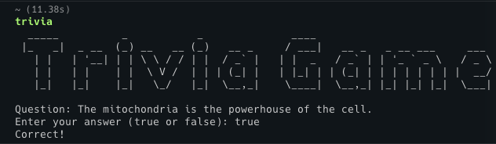

# Trivia Game CLI



## Description

The Trivia Game CLI is a command-line interface application that generates random trivia questions and allows users to answer them. It fetches trivia questions from an API and provides options for users to try to answer the questions or get the correct answer.

## Installation

Install the Trivia CLI globally:

```bash
npm install -g random-trivia-generator
```

## Usage

To start the Trivia Game CLI, run the following command:

```bash
random-trivia-generator
```

You will be presented with a random trivia question:

- Try to answer: Enter your answer and press Enter to check if it's correct.
- Get the answer: Press Enter to display the correct answer.

## Contributing

Contributions are welcome! If you find any issues or have suggestions for improvements, please open an issue or submit a pull request.

## License

This project is licensed under the [MIT License](LICENSE).
